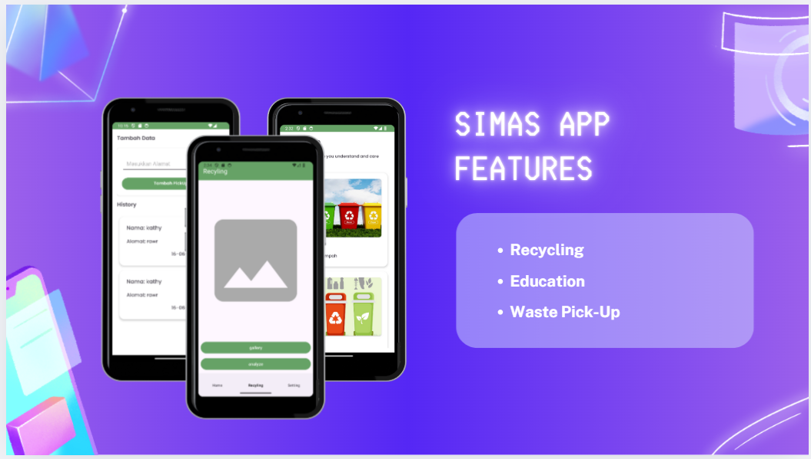
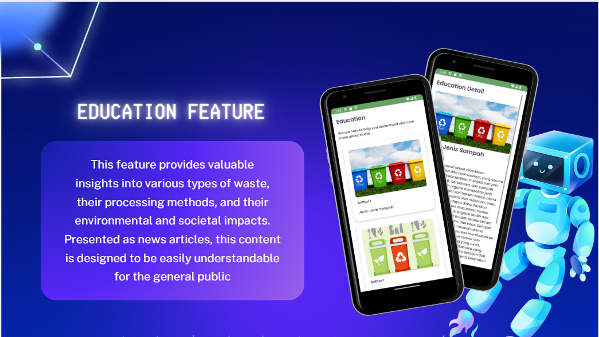
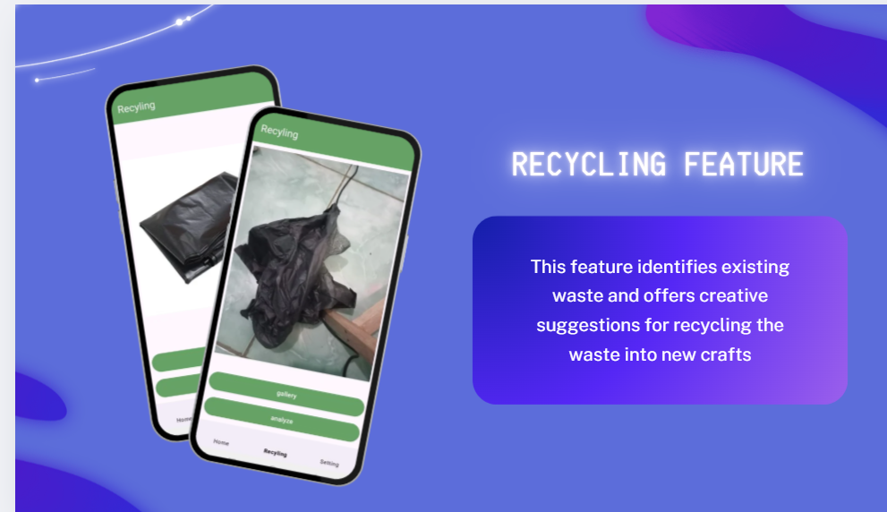
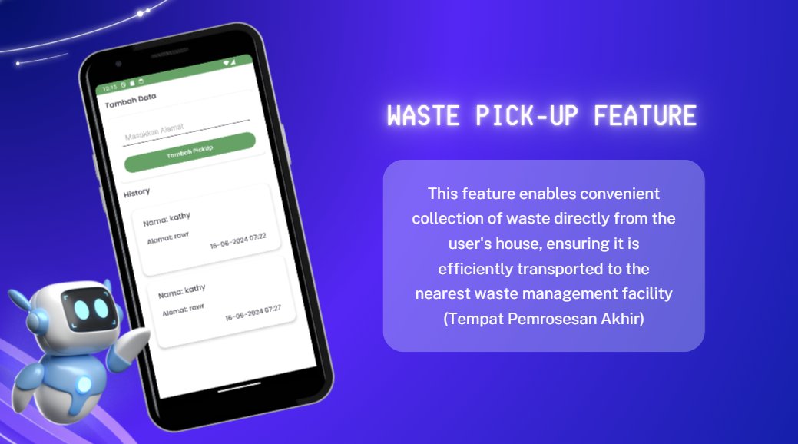
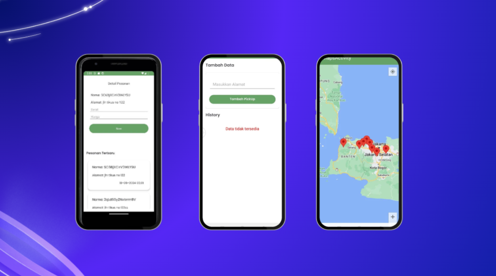

# ♻️ ResikApp

**ResikApp** adalah aplikasi mobile yang memudahkan pengguna untuk melakukan **order penjemputan sampah** serta dilengkapi dengan **fitur AI** yang dapat mengklasifikasikan jenis sampah melalui **kamera (image classification)**.  
Aplikasi ini dikembangkan sebagai **Capstone Project Bangkit Academy 2024 (Path Machine Learning & Mobile Development).**

---

## 📌 Fitur Utama
- 🚛 Order penjemputan sampah dengan mudah.
- 📸 Scan sampah menggunakan kamera untuk mengenali jenis sampah (organik, anorganik, B3, dll).
- 🤖 Model AI berbasis **Convolutional Neural Network (CNN)** untuk klasifikasi sampah.
-  Fitur Edukasi Terkait Sampah
- 👤 Manajemen akun pengguna.
- 📊 Riwayat order & status penjemputan.

---

## 🛠️ Tech Stack
- **Mobile Development**: Android (Kotlin, Jetpack Compose/Fragment)  
- **Machine Learning**: TensorFlow Lite untuk model klasifikasi sampah  
- **Backend & Database**: Firebase (Authentication, Realtime Database, Storage)  
- **API**: Retrofit untuk komunikasi ke backend jika dibutuhkan  

---

## 📂 Struktur Project (ringkas)

````

---
ResikApp/
├── app/
│   ├── java/com/resikapp/
│   │    ├── ui/           # UI/Activity/Fragment
│   │    ├── adapter/      # RecyclerView Adapter
│   │    ├── model/        # Data Model
│   │    ├── repository/   # Repository Pattern
│   │    └── viewmodel/    # ViewModel
│   └── res/               # Layout, Drawable, Values
└── README.md

````

---


---
## 🚀 Cara Menjalankan

1. **Clone repository**
````

---
   ```bash
   git clone https://github.com/ahlilfikri/ResikApp.git
````


---

2. **Buka project di Android Studio**

3. **Tambahkan Firebase Config**

   * Masukkan file `google-services.json` ke dalam folder `app/`.

4. **Sync Gradle dan jalankan aplikasi**

   * Pastikan emulator atau perangkat Android sudah terhubung.

---

## 📸 Tampilan Aplikasi

### 🔑 Fitur



### 🏠 Edukasi



### 📸 Scan Sampah




### 🚛 Order Penjemputan







---

## 👨‍💻 Team Capstone Bangkit 2024

* **Bayu Pratama Agus Kurniawan** – Mobile Development
* **Ahlil Fikri** – Mobile Development
* **Ade Dwi** - Machine Learning
*  **Anisa** - Machine Learning
* **Stalin** - Machine Learning
*  **Kathlen** - Machine Learning


```
